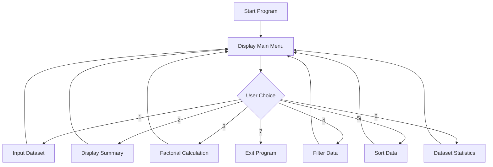
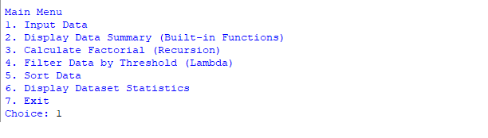
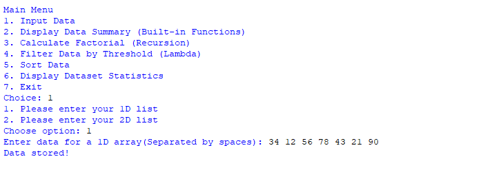
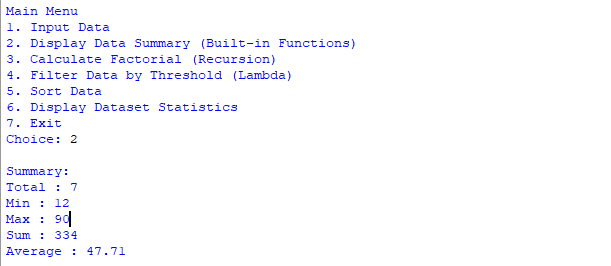
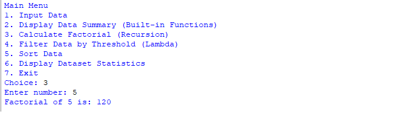
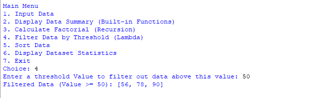
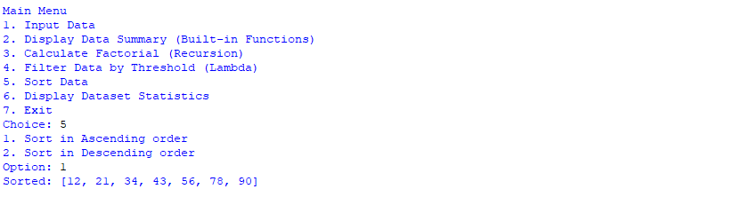
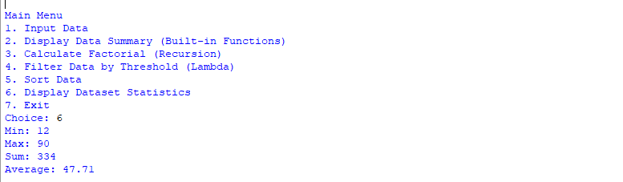
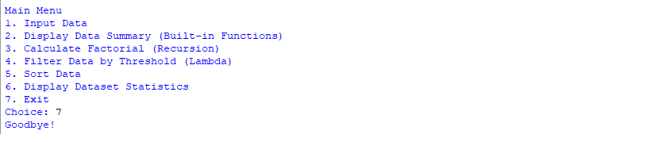
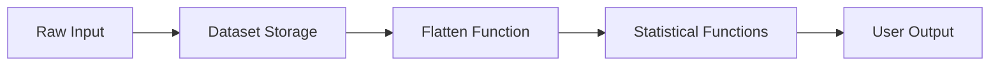

# 🐍 Python Data Processing CLI System


## 📌 Project Overview

This project is a **menu-driven Python command-line application** designed to demonstrate strong foundational programming skills in data handling and algorithmic thinking.

It allows users to input datasets (1D or 2D) and perform multiple analytical operations including statistical summaries, recursive factorial computation, filtering using lambda expressions, and sorting.

The project emphasizes **clean function design, modular structure, and real-world problem solving**, making it suitable for showcasing core Python competencies in a professional portfolio.

```
project4.py
```

---

## 🎯 Key Skills Demonstrated

* Python fundamentals & clean coding practices
* Functional decomposition and modular design
* Recursion implementation
* Lambda expressions and higher-order functions
* Data transformation and statistical analysis
* Interactive CLI application development
* Error handling and user-driven workflows

---

## 🧭 System Architecture

The application follows a structured flow:



---

## 🖥️ Application Walkthrough

### Main Menu Interface

The program runs in a continuous loop, allowing users to perform multiple operations without restarting the application. Each menu option maps to a specific Python concept.

📸 **Screenshot — Main Menu**
---



---

### Option 1 — Input Dataset

Users can input either:

* A 1D numeric list
* A 2D numeric matrix

The dataset is normalized internally for efficient processing.

📸 **Screenshot — Input Dataset**
---




---

### Option 2 — Display Data Summary

Generates a quick statistical overview using Python built-in functions:

* Count
* Minimum
* Maximum
* Sum
* Average

📸 **Screenshot — Data Summary**
---




---

### Option 3 — Recursive Factorial Calculator

Demonstrates recursion by computing factorial values through self-calling functions.

📸 **Screenshot — Factorial Calculation**
---




---

### Option 4 — Lambda-Based Filtering

Applies functional programming techniques using lambda expressions to filter dataset values based on user-defined thresholds.

📸 **Screenshot — Filtered Output**
---




---

### Option 5 — Sorting Engine

Implements ascending and descending sorting using Python’s built-in sorting mechanisms.

📸 **Screenshot — Sorted Data**

---




---

### Option 6 — Dataset Statistics

Performs structured statistical analysis using reusable helper functions.

📸 **Screenshot — Dataset Statistics**
---




---

### Option 7 — Program Exit

Gracefully terminates the application.

📸 **Screenshot — Exit Message**
---




---

## 🧠 Core Functional Design

### Data Processing Pipeline



---

## ▶️ How to Run

```bash
git clone <repository-url>
cd <project-folder>
python project4.py
```

---

## 📁 Project Structure

```
├── project4.py
├── README.md
└── screenshots/
 	-menu.png
	-data_summary.png
	-dataset.png
	-factorial.png
	-goodbye.png
	-input_data.png
	-lambda_function
	-sort.png
```

---

## 🚀 Portfolio Value

This project highlights:

* Practical application of Python fundamentals
* Structured problem-solving ability
* Clean CLI design
* Readable and maintainable code
* Real-world data processing logic

It serves as a strong example of early-stage software engineering capability and programming discipline.

---

## 🔮 Possible Enhancements

* GUI interface using Tkinter or PyQt
* Data visualization with Matplotlib
* File import/export (CSV/JSON)
* Unit testing framework
* Performance optimizations

---

## 📜 License

This project is released under the MIT License.

---

## 👤 Author

Developed as part of a Python learning portfolio project focused on building strong programming foundations.

---

⭐ If you found this project useful, consider starring the repository!
"# Project-4" 
